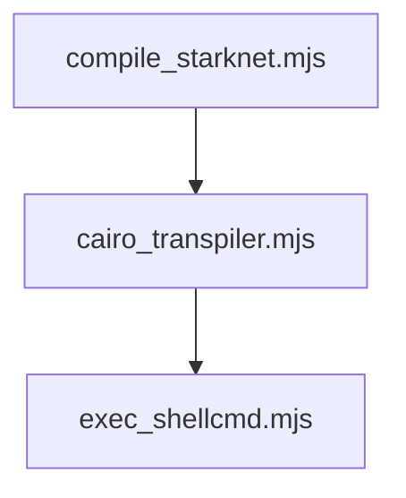

# starknet-transpiler-box (Alpha)

(Testing warp transpilation on truffle)

The Truffle StarkNet-transpiler Box provides the boilerplate Truffle structure necessary to start coding for StarkWare's Ethereum L2 solution, StarkNet. This is different from starknet box as it allows the developer to write solidity contracts and the compiler will automatically transpile these contracts to cairo contracts and deploy them on strakent without the user having to do any extra work.

## Installation Instructions

1. As yet this box has not been officially published on truffles repo so for now to unbox run:

```bash
truffle unbox https://github.com/Vishvesh-rao/starknet-test-box
```
2. The solidity contracts to be transpiled should be put into `/contracts/ethereum/` folder.

3. At this point if you are not in the root folder of your project then return to the root folder.

4. go to the scripts directory:
```bash
cd scripts/ 
```
5. Installing packages
```bash
npm i fs-jetpack rimraf
```
6. run `compile_starknet.mjs`:
```bash
node compile_starknet.mjs
```

Once this finishes all your contracts present in `<project-root>/contracts/ethereum/` will be converted into cairo contracts and you can see those in `<project-root>/contracts/starknet/`

## Box Structure

The main core of this box is in the `scripts` directory. This directory contains all the necessary l2 compilation/deploying files to enable cairo contracts to be deployed to starkWares networks.

On unboxing the entire box is set up and the ethereum folder is created under `<project-root>/contracts/ethereum/`.

Solidity contracts present in this folder will be converted into ciaro contracts and stored in `<project-root>/contracts/starknet/`.

The three main files that are releavant for transpiling solidity to cairo are present in the scripts folder.
- [`cairo_transpiler.mjs`](https://github.com/Vishvesh-rao/starknet-test-box/blob/main/scripts/cairo_transpiler.mjs)
- [`compile_starknet.mjs`](https://github.com/Vishvesh-rao/starknet-test-box/blob/main/scripts/compile_starknet.mjs)
- [`exec_shellcmd.mjs`](https://github.com/Vishvesh-rao/starknet-test-box/blob/main/scripts/exec_shellcmd.mjs)

***Import order:***



### #cairo_transpiler.mjs

This is the main executeble file which links truffle to warp and transpiling the contracts and is also responsible for certain folder creations, moving around of contracts, and at the end deleting any extra folders created and storing the transpiled cairo contracts into `<project-root>/contracts/starknet/`.

It imports from `exec_shellcmd.mjs` to enable execution of shell commands.

### #exec_shellcmd.mjs

This is a utillity module which defines the `run()` fucntion to execute shell commands.

### #compile_starknet.mjs

This contract is main module with regards to the compilation of cairo contracts stored in `<project-root>/contracts/starknet/`.

This imports `cairo_transpiler.mjs` module 

